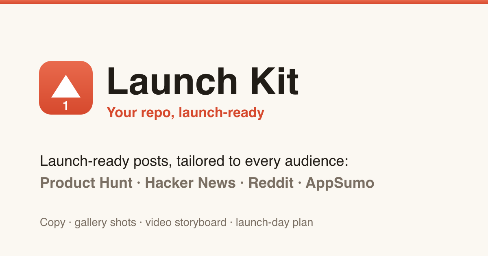
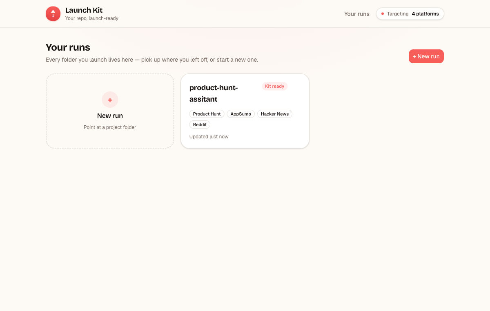
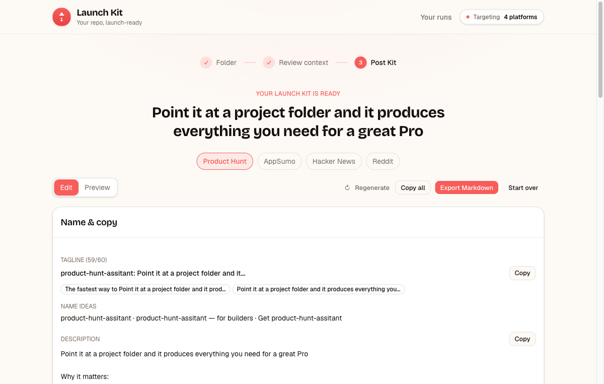

<div align="center">

# ⚡ Launch Kit

### Turn your repo into a launch worth upvoting.

Point Launch Kit at a project folder. It reads your README and drafts **launch‑ready posts — written natively for [Product Hunt, Hacker News, Reddit, and AppSumo](#-one-repo-every-audience)**. Runs 100% on your machine. Bring your own [OpenRouter](https://openrouter.ai) key.

[](https://github.com/AhmedFr/launch-kit/actions/workflows/ci.yml)
[](https://github.com/AhmedFr/launch-kit/stargazers)
[](./LICENSE)
[](https://nextjs.org)
[](#-local-first--private)



</div>

---

## ✨ What you get

- **One core, four native posts.** Launch Kit distills your project once, then rewrites it for each platform's audience — not one blurb copy‑pasted everywhere.
- **A guided launch, not just copy.** Gallery shot lists, a demo‑video storyboard, posting times, and a launch‑day checklist.
- **Live previews.** See each post rendered the way it'll actually look on Product Hunt, HN, Reddit, and AppSumo.
- **Your runs, saved.** Every folder you launch is kept locally so you can pick up where you left off.
- **Private by design.** Your code and README never leave your machine. No backend, no database, no account.
- **Bring your own key.** Use the built‑in mock generator key‑free, or plug in your OpenRouter key for the real thing.

## 🚀 Quickstart

```bash
git clone https://github.com/AhmedFr/launch-kit.git
cd launch-kit
pnpm install
pnpm dev          # open the printed local URL
```

Out of the box it runs on the **mock** generator — the full flow works with **no API key**. To generate with a real model, add your OpenRouter key (below) and set `GENERATION_PROVIDER=openrouter`.

## 🔑 Configuration

Copy `.env.example` to `.env` and fill in what you need:

| Variable | Default | Purpose |
| --- | --- | --- |
| `GENERATION_PROVIDER` | `mock` | `mock` (no key, instant) or `openrouter` (real generation) |
| `OPENROUTER_API_KEY` | — | Your [OpenRouter](https://openrouter.ai/keys) key. Required when the provider is `openrouter`. |
| `OPENROUTER_MODEL` | `anthropic/claude-sonnet-4.6` | Any current OpenRouter model id. |
| `LAUNCHKIT_ALLOW_LOCAL_FS` | — | Only set to `true` if you run a **production** build (`pnpm build && pnpm start`) on your own machine. See [Local‑first](#-local-first--private). |

## 🧭 How it works

A three‑step wizard, one run per folder:

1. **Point at a folder** — paste an absolute path. A local Node route reads your `README` and `package.json` into a structured context.
2. **Review the context** — confirm what was found and add intent: audience, angle, goal, tone.
3. **Get per‑platform kits** — browse, copy any piece, regenerate a platform, or export to Markdown.



## 🎯 One repo, every audience

| Platform | What Launch Kit writes |
| --- | --- |
| **Product Hunt** | Tagline + alternatives, description, topics, gallery shot list, video storyboard, maker's first comment, launch‑day ops & outreach |
| **Hacker News** | A `Show HN:` title, an honest technical post, your first comment, and posting tips |
| **Reddit** | Subreddit recommendations, a value‑first title + body, and comment etiquette |
| **AppSumo** | Deal headline, lifetime‑deal pitch, what's included, who it's for, and an FAQ |



## 🔒 Local‑first & private

Launch Kit reads files from disk, so it's built to run **on your machine** — your repo never leaves it. The folder‑analysis route is **disabled in production builds by default**, so a hosted/public instance can't be coerced into reading its own filesystem. `pnpm dev` works out of the box; if you run a production build locally and want folder analysis, set `LAUNCHKIT_ALLOW_LOCAL_FS=true`.

## ⭐ Star milestone

> **⭐ Hit 50 stars and I'll ship a free hosted version** — Launch Kit running in your browser, no clone and no API key required. If Launch Kit saves you a launch, a star genuinely helps.

## 🛠️ Tech stack

Next.js 16 (App Router) · React 19 · TypeScript · Tailwind CSS v4 · base‑ui / shadcn · Zod · Vitest. State persists to `localStorage`; generation goes through a small provider interface (mock or OpenRouter).

## 📁 Project structure

```
app/                  routes: / (landing), /runs, /runs/new, /runs/[id], /api/*
components/           UI — brand, post-kit (+ per-platform sections), previews, runs
lib/
  generation/         core + per-platform prompts, schemas, providers
  runs/               localStorage-backed run store + hooks
  preview/  export/   platform preview registry + Markdown export
  analyze/  wizard/   local folder analysis + wizard reducer
```

## 📜 Scripts

```bash
pnpm dev         # start the dev server
pnpm build       # production build
pnpm start       # serve the production build
pnpm test        # run the vitest suite
pnpm lint        # eslint
pnpm typecheck   # tsc --noEmit
```

## 🤝 Contributing

Issues and PRs welcome. Run `pnpm test && pnpm typecheck && pnpm lint` before opening a PR.

## 📄 License

[MIT](./LICENSE) © Ahmed Abouelleil
